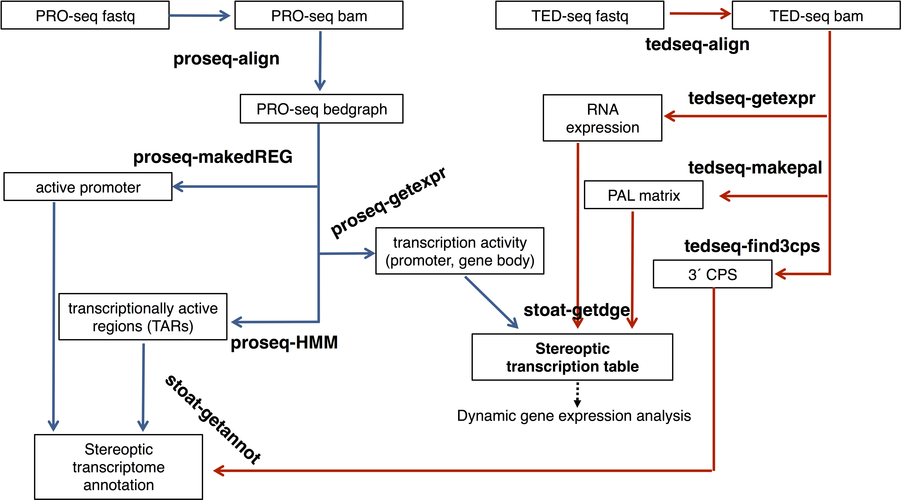

# stoat
**St**ere**o**ptic **a**nalysis of the **t**ranscriptome using PRO-seq and TED-seq

## Summary 
Stereoptic transcriptome analysis that adds dynamics-perception using binocular perspectives of the static transcriptome; transcription rate and polyadenylation status. Transcription rate, measured by nascent RNA sequencing (PRO-seq), reflects the RNA synthesis level. Poly(A) tail length (PAL), measured by TED-seq, reflects the quality of the RNA, and is associated with translation and decay status. The starts and the ends of transcripts can be mapped using PRO-seq and TED-seq to re-define high-confidence annotation including novel transcripts. Transcriptional and post-transcriptional expression analysis identifies dynamically regulated transcripts.

## Installation

### Supported OS
Linux, Mac OS X

### Prerequisite
* Samtools (http://www.htslib.org/)
* Bedtools (https://bedtools.readthedocs.io/en/latest/)
* STAR or bowtie aligner (https://github.com/alexdobin/STAR/releases or http://bowtie-bio.sourceforge.net/index.shtml)
* dREG (https://github.com/Danko-Lab/dREG)

## Flowchart


## Usage

### proseq-align
```
Usage:   proseq-align [options] -f <fastq> -r <reference genome>
Options:
        -a      alinger (STAR/BOWTIE; default = STAR)
        -b      output filename base (default = proseq.out)
Output:  [output filename base].bam
         [output filename base].pl.bedgraph 
         [output filename base].mn.bedgraph
```
### proseq-makedREG
```
```
### proseq-HMM
```
```
### proseq-getexpr
```
```
### tedseq-align
```
```
### tedseq-find3cps
```
```
### tedseq-makepal 
```
Usage: tedseq-makepal [options] -a <bam> -b <bed>
Options:
        -bin    bin size (default = 1)
        -win    window size (default = 500)
```
### tedseq-getexpr
```
```
### stoat-getannot
```
```
### stoat-getdge
```
```

## Documentation

## How to cite
Lee S.H., Woo Y.M., Kwak H. (2018). Stereoptic transcriptome analysis refines functional gene annotation and identifies polyadenylation of atypical transcripts.
