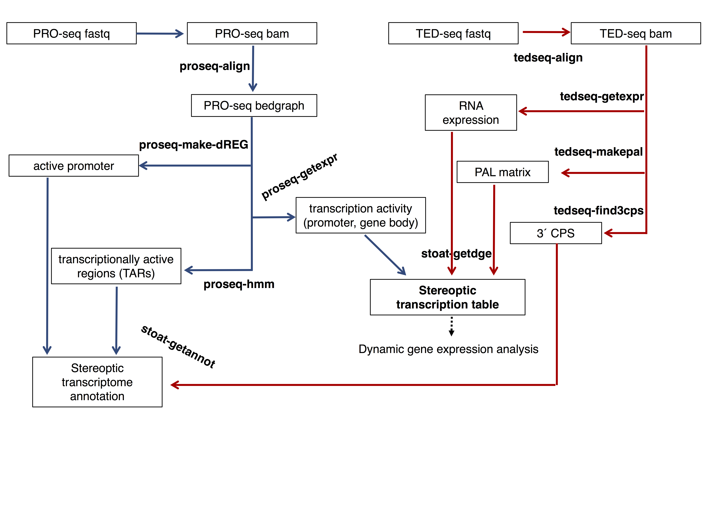
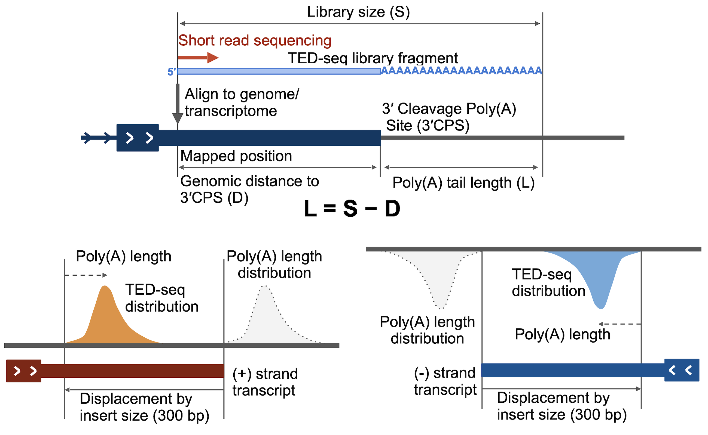
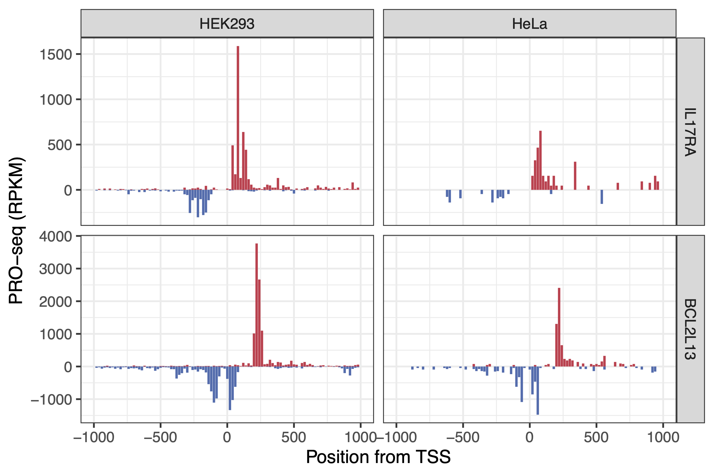
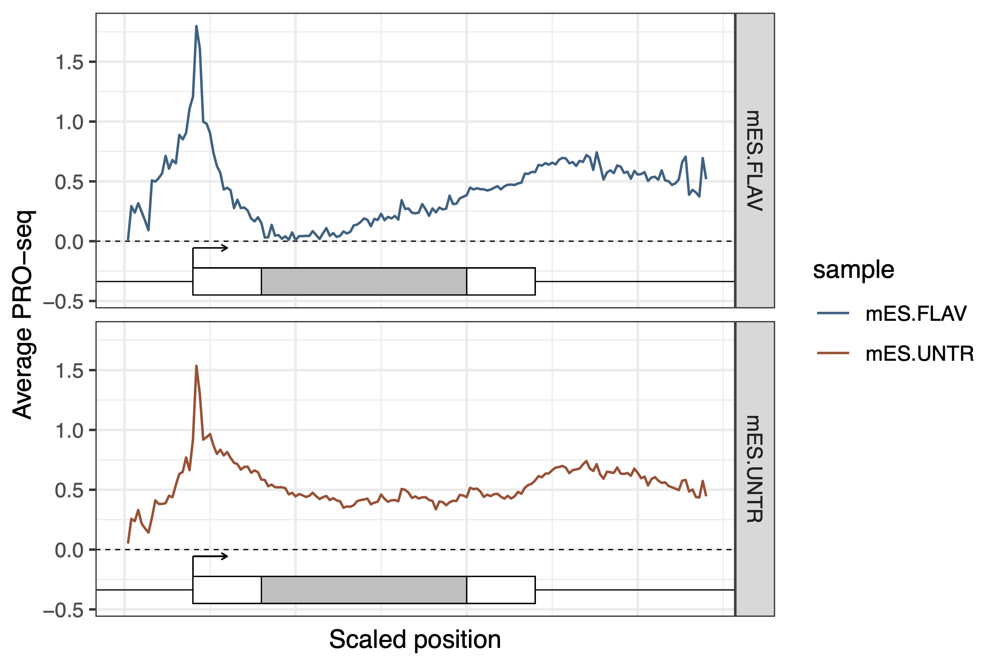

# stoat
**St**ere**o**scopic **a**nalysis of the **t**ranscriptome using PRO-seq and TED-seq

## Summary

Stereoscopic transcriptome analysis that adds dynamics-perception using binocular perspectives of the static transcriptome; transcription rate and polyadenylation status. Transcription rate, measured by nascent RNA sequencing (PRO-seq), reflects the RNA synthesis level. Poly(A) tail length (PAL), measured by TED-seq, reflects the quality of the RNA, and is associated with translation and decay status. The starts and the ends of transcripts can be mapped using PRO-seq and TED-seq to re-define high-confidence annotation including novel transcripts. Transcriptional and post-transcriptional expression analysis identifies dynamically regulated transcripts.

## Installation

### Supported OS
Linux (Ubuntu), Mac OS X

### Prerequisites
* samtools (http://www.htslib.org/)
* bedtools (https://bedtools.readthedocs.io/en/latest/)
* cutadapt (https://cutadapt.readthedocs.io/en/stable/)
* STAR or bowtie aligner (https://github.com/alexdobin/STAR/releases or http://bowtie-bio.sourceforge.net/index.shtml)
* bedGraphToBigWig, gtfToGenePred, genePredToBed (http://hgdownload.soe.ucsc.edu/admin/exe/)

These softwares should be accessibile in your PATH

### Install stoat
* Download to your installation directory
* Go to your installation directory and run make
```
cd /(your)/(installation)/(directory)
make
```
* Copy the stoat file to one of your PATH accessible directory
```
cp /(your)/(installation)/(directory)/bin/stoat ~/.local/bin/ 
```

<!--
## Flowchart

-->

## Quickstart
In the example directory,
```
cd /(your)/(installation)/(directory)/bin/stoat/example
gunzip *.gz
```
PRO-seq pipeline
```
stoat make-pro -f PROseq.chr22.fastq -g gencode.v26.annotation.chr22.gtf -r (human reference genome)
```
TED-seq pipeline
```
stoat make-ted -f TEDseq.chr22.fastq -g gencode.v26.annotation.chr22.gtf -r (human reference genome)
```

## Usage

### stoat
```
stoat:   stereoscopic analysis of the transcriptome using PRO-seq and TED-seq
version: 0.1.190924

usage:   stoat <command> [options]

command: make-pro   process PRO-seq data
         make-ted   process TED-seq data
         align-ted2 align TED2 data
         make-ted2  process TED2 data
         redef3     redefine 3CPS in high resolution
         pap        generate polyA length profiles
         prop       generate PRO-seq profiles
         elongHMM   calculate PRO-seq elongation rates
```
This is a wrapper for all stoat commands. Available commands are described under the headings below.


## stoat make-pro
```
tool:    stoat make-pro
version: 0.1.191014

usage:   stoat make-pro [options] -f <fastq> -g <gtf> -r <reference genome>

options:
         -a   aligner (STAR/BOWTIE; default = STAR)
         -o   output directory (default = proseq.out)
```
Processes raw PRO-seq fastq data. First 8 bases of PRO-seq reads are unique molecular identifiers (UMIs). Make-pro aligns raw reads to the reference genome provided, collapses duplicate reads with identical UMIs, and generates a table of PRO-seq read counts at gene regions. 

Other inputs
- \<reference genome\> pre-assembled reference genome index
- \<gtf\> gene annotation in gtf format.

### Output
Generates a directory structure
```
(output directory)
  ├── alignment
  │   ├── a.bam
  │   ├── a.mn.bedgraph
  │   └── a.pl.bedgraph
  ├── annotation
  │   └── transcripts.bed13
  ├── table
  │   └── expression.txt
  └── sample_info.txt
```
- (output directory)/alignment/a.bam : aligned bam file with unique molecular identifiers collapsed
- (output directory)/alignment/a.pl.bedgraph : (+) strand bedgraph file of PRO-seq raw read counts
- (output directory)/alignment/a.mn.bedgraph : (-) strand bedgraph file of PRO-seq raw read counts
- (output directory)/table/expression.txt : table of PRO-seq gene expression counts (raw and normalized)

### PRO-seq expression table
Column description of /table/expression.txt
- id: trasncript id (ENST)
- pp: promoter proximal raw read count (TSS to +500)
- gb: gene body raw read coverage (reads at the same positions are regarded as duplicates)
- ex: raw read counts on exons (comparable to RNA-seq quantification)
- RPKMpp: normalized promoter proximal read count (Reads per kilobase per million mapped reads)
- eRPKMgb: normalized gene body read count (effective RPKM, RPKM of read coverage converted by count/coverage factor)
- eRPKMex: normalized exon read count (effective RPKM)


## stoat make-ted
```
tool:    stoat make-ted
version: 0.1.190924

usage:   stoat make-ted [options] -f <fastq> -g <gtf> -r <reference genome>

options:
         -a   aligner (STAR/BOWTIE; default = STAR)
         -o   output directory (default = tedseq.out)
```
 Processes raw TED-seq fastq data. Make-ted aligns TED-seq reads, generates expression and poly(A) tail length tables. Poly(A) tail lengths are determined from Library Insert Size (LIS). TED-seq reads that spans across introns are corrected to report corresponding poly(A) tail length positions.

Input
- \<reference genome\> pre-assembled reference genome index
- \<gtf\> gene annotation in gtf format.

### Output
Generates a directory structure
```
(output directory)/
  ├── alignment
  │   ├── a.bam
  │   ├── a.mn.bedgraph
  │   └── a.pl.bedgraph
  ├── annotation
  │   └── transcripts.bed13
  ├── table
  │   ├── expression.txt
  │   ├── medianpal.txt
  │   └── palmatrix.txt
  ├── Rdata
  │   └── PALdata.rds
  └── sample_info.txt
```
- (output directory)/alignment/a.bam : aligned bam file with unique molecular identifiers collapsed
- (output directory)/alignment/a.pl.bedgraph : (+) strand bedgraph file of TED-seq raw read counts
- (output directory)/alignment/a.mn.bedgraph : (-) strand bedgraph file of TED-seq raw read counts
- (output directory)/table/expression.txt : table of TED-seq gene expression counts (raw and normalized)
- (output directory)/table/medianpal.txt : table of median poly(A) tail lengths 
- (output directory)/table/palmatrix.txt : matrix of poly(A) tail length distributions
- (output directory)/Rdata/PALdata.rds : R data object of poly(A) tail length distributions
	
### TED-seq expression table
Column description of /table/expression.txt
- id: trasncript id (ENST)
- ted: raw read count near 3' end (-500 from PAS to PAS)
- RPKMted: normalized TED-seq read count (Reads per kilobase per million mapped reads)

### Poly(A) tail length distribution matrix
Description of /table/palmatrix.txt
- First column: transcript id
- Next 501 columns: raw reads mapped to position -500 to PAS (= poly(A) lengths from LIS - 500 to LIS)


## stoat align-ted2
```
tool:    stoat align-ted2
version: 0.1.190924

usage:   stoat align-ted2 [options] -1 <read 1> -2 <read 2> -r <reference genome>

options:
         -o   output filename base (default = ted2.out)
```
Alignment pipeline for TED2-seq fastq files. TED2-seq uses paired end reads. Custom sample barcodes are contained in read 1, and UMI is in read 2. Align-ted2 performs sample barcode splitting (e.g. ted2.out.1.bam ... ted2.out.10.bam) and UMI collapsing. Each bam file can be used to generate directory structure compatible with TED-seq pipeline using make-ted2.


## stoat make-ted2
```
tool:    stoat make-ted2
version: 0.1.190924

usage:   stoat make-ted2 [options] -b <bam> -g <gtf>

options:
         -o   output directory (default = tedseq.out)
         --s  library size (default = 425 bp)
```
Generates TED-seq directory structure identical to make-ted using bam file created by align-ted2 for TED2-seq data. For library size (--s), Use final library size including the full TRU-seq primer lengths (e.g. Bioanalyzer peak size).


## stoat redef3
```
tool:    stoat redef3
version: 0.1.191018

usage:   stoat redef3 [options] -d <TEDseq dir>

options:
         -b   3'CPS junction bam (default = stoat/refdata/HEK)
         -S   antisense strand bam (default = sense strand)
         -fa  reference genome fasta (default = none)
```
Re-defines 3'CPS based on TED-seq or 3'-seq bam data that contains junction between 3'UTR and poly(A) site. If a 3'CPS junction bam file is not provided, redef3 uses human 3'CPS data in HEK293 cells. If a 3' end junction is not detected, redef3 keeps the 3'CPS (PAS) of the reference annotation. Poly(A) tracks in the sequence may create false 3'CPS-like junctions, and will be removed if reference genome fasta file (-fa) is provided.

### Output
Creates files under the table directory
- (output directory)/table/3cps_redef.txt : redefined 3'CPS positions
- (output directory)/table/medianpal.txt : updated median poly(A) tail length table

### 3'CPS redefinition
Column description of /table/3cps_redef.txt
- First column: trasncript id (ENST)
- Second column: relative position of 3'CPS from annotated PAS.
- Third column: raw read count at the re-annotated 3'CPS positions.

## prop
```
tool:    stoat prop - PRO-seq profile
version: 0.1.191001

usage:   stoat prop [options] -d <PROseq dirs> -g <gene lists txt>

options:
         -b   TSS bed files instead of gene list (default = none)
         -o   output plot file name (default = pro.out.pdf)
         -w   width of the output pdf (default = 6)
         -h   height of the output pdf (default = 4)
         --sc scaled gene body profile (default = TSS proximal)
         --de sample/gene group descriptions (default = none)
         --lg y axis in log scale (default = linear)
```
Generates PRO-seq profile plots. Outputs pdf files of PRO-seq profile plots.

### Output
#### Example 1. PRO-seq profiles near the TSS of listed genes in 2 datasets

example/genes.txt
```
IL17RA
BCL2L13
```
Run
```
stoat prop -d example/PROseq_HEK example/PROseq_HeLa -g example/genes.txt
```


#### Example 2. Scaled average PRO-seq profiles (metagenes) in 2 datasets

Use 2 example datasets in mouse embryonic stem cell control and flavopiridol treated (Jonkers et al, 2014, eLife)

Run
```
stoat prop -d example/mES_baseline example/mES_flavopiridol -b example/mES_baseline/annotation/transcripts.bed13 --sc --lg
```


## pap
```
tool:    stoat pap
version: 0.1.191018

usage:   stoat pap [options] -d <TEDseq dirs> -g <gene lists txt>

options:
         -b   3'CPS bed files instead of gene list (default = none)
         -o   output plot file name (default = palout.pdf)
         -w   width of the output pdf (default = 6)
         -h   height of the output pdf (default = 4)
         --od output data (default = none)
         --de sample/gene group descriptions (default = none)
         --os overlay TED-seq data (default = false)
         --og overlay gene groups (default = false)
```

## elongHMM
```
tool:    stoat elongHMM
version: 0.1.191114

usage:   stoat elongHMM [options] -f <Clearance PRO-seq dir> -b <Baseline PRO-seq dir>

options:
         -bs  Bin size (default = 1000)
         -bc  Bin count (default = 50)
         -out Output file (default = out.elong.txt)
```
<!--
### getdge
```
tool:    stoat getdge
version: 0.1.191114

Usage:	stoat-getdge -pro <proseq-getexpr file> -ted <tedseq-getexpr file> -pal <tedseq-makepal file>

Options:
	-win	PAL window (default = 500)
	-ins	PAL insert size (default = 250)
	-max	PAL max length (default = 250)         

```

### getannot 
```   
tool:    stoat getannot
version: 0.1.191114

Usage: stoat-getannot [options] -a <dREG bedgraph> -b <PRO-seq HMM TAR bed> -c <3'CPS bed>

Options:
	-g	gene assembly bed (default = NA)
	-cp	dREG distance cut-off (default = 200 bp)
	-cc	3'CPS distance cut-off (default = 200 bp)
	-ch	HMM mutual coverage cut-off (default = 80%)
	-dd	Distance between divergent transcription peaks (default = 150)
       
``` 
-->
	
## How to cite 

Lee S.A., Kwak H. Stereoscopic transcriptome analysis depicts transcriptional and post-transcriptional RNA regulation
