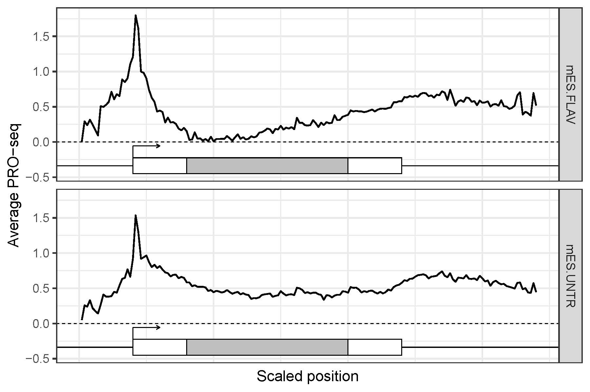

# stoat
**St**ere**o**scopic **a**nalysis of the **t**ranscriptome using PRO-seq and TED-seq

## Summary 
Stereoscopic transcriptome analysis that adds dynamics-perception using binocular perspectives of the static transcriptome; transcription rate and polyadenylation status. Transcription rate, measured by nascent RNA sequencing (PRO-seq), reflects the RNA synthesis level. Poly(A) tail length (PAL), measured by TED-seq, reflects the quality of the RNA, and is associated with translation and decay status. The starts and the ends of transcripts can be mapped using PRO-seq and TED-seq to re-define high-confidence annotation including novel transcripts. Transcriptional and post-transcriptional expression analysis identifies dynamically regulated transcripts.

## Installation

### Supported OS
Linux, Mac OS X

### Prerequisites
* samtools (http://www.htslib.org/)
* bedtools (https://bedtools.readthedocs.io/en/latest/)
* cutadapt (https://cutadapt.readthedocs.io/en/stable/)
* STAR or bowtie aligner (https://github.com/alexdobin/STAR/releases or http://bowtie-bio.sourceforge.net/index.shtml)
* dREG (https://github.com/Danko-Lab/dREG)
* bedGraphToBigWig, gtfToGenePred, genePredToBed (http://hgdownload.soe.ucsc.edu/admin/exe/)

These softwares should be accessibile in your PATH

### Install stoat
* Download to your installation directory
* Go to your installation directory and run make
```
cd /(your)/(installation)/(directory)
make
```
* Copy the stoat file to one of your PATH accessible directory
```
cp /(your)/(installation)/(directory)/bin/stoat ~/.local/bin/ 
```

## Flowchart


## Quickstart
In the example directory,
```
cd /(your)/(installation)/(directory)/bin/stoat/example
gunzip *.gz
```
PRO-seq pipeline
```
stoat make-pro -f PROseq.chr22.fastq -g gencode.v26.annotation.chr22.gtf -r (human reference genome)
```
TED-seq pipeline
```
stoat make-ted -f TEDseq.chr22.fastq -g gencode.v26.annotation.chr22.gtf -r (human reference genome)
```
Combined analysis pipeline
```
stoat-getannot -a <dREG bedgraph> -b <PRO-seq HMM TAR bed> -c <3'CPS bed>
```

## Usage

### stoat
```
stoat:   stereoscopic analysis of the transcriptome using PRO-seq and TED-seq
version: 0.1.190924

usage:   stoat <command> [options]

command: make-pro   process PRO-seq data
         make-ted   process TED-seq data
         redef3     redefine 3CPS in high resolution
         pap        generate polyA length profiles
         prop       generate PRO-seq profiles
         elongHMM   calculate PRO-seq elongation rates
```
Wrapper for stoat commands

### make-pro
```
tool:    stoat make-pro
version: 0.1.191014

usage:   stoat make-pro [options] -f <fastq> -g <gtf> -r <reference genome>

options:
         -a   aligner (STAR/BOWTIE; default = STAR)
         -o   output directory (default = proseq.out)
```
Output: generates a directory structure\
```
(output directory)/
  ├── alignment
  │   ├── a.bam
  │   ├── a.mn.bedgraph
  │   └── a.pl.bedgraph
  ├── annotation
  │   └── transcripts.bed13
  └── sample_info.txt
```
  * (output directory)/alignment/a.bam : aligned bam file with unique molecular identifiers collapsed
  * (output directory)/alignment/a.pl.bedgraph : (+) strand bedgraph file of PRO-seq raw read counts
  * (output directory)/alignment/a.mn.bedgraph : (-) strand bedgraph file of PRO-seq raw read counts

### prop
```
tool:    stoat prop - PRO-seq profile
version: 0.1.191001

usage:   stoat prop [options] -d <PROseq dirs> -g <gene lists txt>

options:
         -b   TSS bed files instead of gene list (default = none)
         -o   output plot file name (default = proout.pdf)
         -w   width of the output pdf (default = 6)
         -h   height of the output pdf (default = 4)
         --sc scaled gene body profile (default = TSS proximal)
         --de sample/gene group descriptions (default = none)
         --lg y axis in log scale (default = linear)
```
Output: pdf file of PRO-seq profile plots\


### make-ted
```
tool:    stoat make-ted
version: 0.1.190924

usage:   stoat make-ted [options] -f <fastq> -g <gtf> -r <reference genome>

options:
         -a   aligner (STAR/BOWTIE; default = STAR)
         -o   output directory (default = tedseq.out)
```
Output: generates a directory structure\
```
(output directory)/
  ├── alignment
  │   ├── a.bam
  │   ├── a.mn.bedgraph
  │   └── a.pl.bedgraph
  ├── annotation
  │   └── transcripts.bed13
  └── sample_info.txt
```
  * (output directory)/alignment/a.bam : aligned bam file with unique molecular identifiers collapsed
  * (output directory)/alignment/a.pl.bedgraph : (+) strand bedgraph file of PRO-seq raw read counts
  * (output directory)/alignment/a.mn.bedgraph : (-) strand bedgraph file of PRO-seq raw read counts
  
### redef3
```
tool:    stoat redef3
version: 0.1.191018

usage:   stoat redef3 [options] -d <TEDseq dir>

options:
         -b   3'CPS junction bam (default = stoat/refdata/HEK)
         -S   antisense strand bam (default = sense strand)
         -fa  reference genome fasta (default = none)

### stoat elongHMM
```
tool:    stoat elongHMM
version: 0.1.191114

usage:   stoat elongHMM [options] -f <Clearance PRO-seq dir> -b <Baseline PRO-seq dir>

options:
         -bs  Bin size (default = 1000)
         -bc  Bin count (default = 50)
         -out Output file (default = out.elong.txt)
         
### stoat-getdge
```
Usage:	stoat-getdge -pro <proseq-getexpr file> -ted <tedseq-getexpr file> -pal <tedseq-makepal file>
Options:
	-win	PAL window (default = 500)
	-ins	PAL insert size (default = 250)
	-max	PAL max length (default = 250)         
     
### stoat-getannot [options] -a <dREG bedgraph> -b <PRO-seq HMM TAR bed> -c <3'CPS bed>
```         
Options:
	-g	gene assembly bed (default = NA)
	-cp	dREG distance cut-off (default = 200 bp)
	-cc	3'CPS distance cut-off (default = 200 bp)
	-ch	HMM mutual coverage cut-off (default = 80%)
	-dd	Distance between divergent transcription peaks (default = 150)
       

## How to cite
Lee S.A., Kwak H. Stereoscopic transcriptome analysis depicts transcriptional and post-transcriptional RNA regulation
