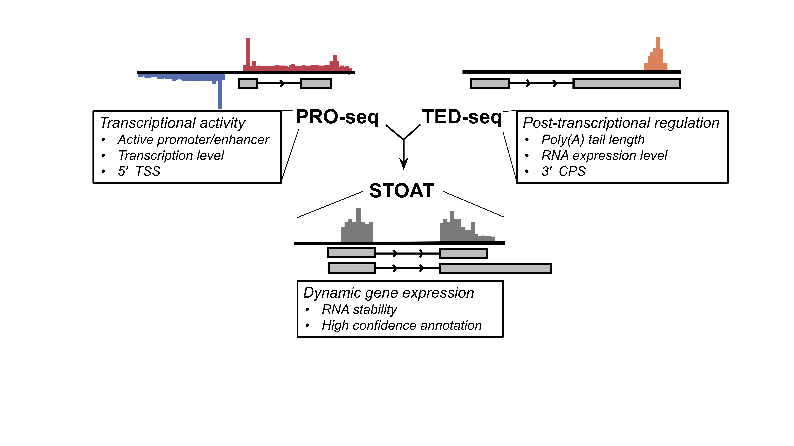

# stoat
**St**ere**o**ptic **a**nalysis of the **t**ranscriptome using PRO-seq and TED-seq

## Summary 
Stereoptic transcriptome analysis that adds dynamics-perception using binocular perspectives of the static transcriptome; transcription rate and polyadenylation status. Transcription rate, measured by nascent RNA sequencing (PRO-seq), reflects the RNA synthesis level. Poly(A) tail length (PAL), measured by TED-seq, reflects the quality of the RNA, and is associated with translation and decay status. The starts and the ends of transcripts can be mapped using PRO-seq and TED-seq to re-define high-confidence annotation including novel transcripts. Transcriptional and post-transcriptional expression analysis identifies dynamically regulated transcripts.

## Installation

### Supported OS
Linux, Mac OS X

### Prerequisites
* samtools (http://www.htslib.org/)
* bedtools (https://bedtools.readthedocs.io/en/latest/)
* cutadapt (https://cutadapt.readthedocs.io/en/stable/)
* STAR or bowtie aligner (https://github.com/alexdobin/STAR/releases or http://bowtie-bio.sourceforge.net/index.shtml)
* dREG (https://github.com/Danko-Lab/dREG)
* bedGraphToBigWig (http://hgdownload.soe.ucsc.edu/admin/exe/)

These softwares should be accessibile in your PATH

### Install stoat
* Download to your installation directory
* Go to your installation directory and run make
```
cd /(your)/(installation)/(directory)
make
```
* Add the bin directory to PATH
```
PATH=$PATH:/(your)/(installation)/(directory)/bin
```

## Flowchart


## Quickstart


## Usage

### proseq-align
```
Usage:   proseq-align [options] -f <fastq> -r <reference genome>
Options:
        -a      alinger (STAR/BOWTIE; default = STAR)
        -b      output filename base (default = proseq.out)
```
Output: generates 3 files
  * \<output filename base>.bam : aligned bam file with unique molecular identifiers collapsed
  * \<output filename base>.pl.bedgraph : (+) strand bedgraph file of PRO-seq raw read counts
  * \<output filename base>.mn.bedgraph : (-) strand bedgraph file of PRO-seq raw read counts
         
### proseq-make-dREG
```
Usage:   proseq-make-dREG [options] -p <PRO-seq filename base> -s <dREG SVM RData>
Options:
        -c      number of CPU cores (default = 4)
        -g      GPU ID if multiple GPUs are available(default = NA)
```
Output: bedgraph format of dREG scores (transcriptional activity)

### proseq-hmm
```
Usage:  proseq-hmm [options] -p <PRO-seq filename base>
Options:
        -w      window size (default = 500 bp) 
```
Output: bed format of transcription active regions (TAR)
1. chromosome
2. start
3. end
4. TAR ID
5. (empty)
6. strand

### proseq-getexpr
```
Usage:  proseq-getexpr [options] -p <PRO-seq filename base> -g <gene annotation bed12>
Options: 
        -w      Promoter range (default = 500 bp)
```
Output: reports
1. Gene ID/name in annotated bed file
2. Promoter raw read counts
3. Gene body read coverage
4. Exon read coverage
5. Promoter RPKM
6. Gene body eRPKM
7. Exon eRPKM

### tedseq-align
```
Usage:  tedseq-align [options] -f <fastq> -r <reference genome>
Options:
        -a      alinger (STAR/BOWTIE; default = STAR)
        -b      output filename base (default = tedseq.out)
```
Output:
  * \<output filename base>.bam : aligned bam file with unique molecular identifiers collapsed
  * \<output filename base>.pl.bedgraph : (+) strand bedgraph file of TED-seq raw read counts
  * \<output filename base>.mn.bedgraph : (-) strand bedgraph file of TED-seq raw read counts

### tedseq-find3cps   
```
Usage:  tedseq-find3cps [options] -t <TED-seq filename base>
Options:
        -c      Raw read count cut-off (default = 5 reads)
        -b      Bin size/resolution (default = 5 bp)
        -s      Library insert size (default = 250 bp)
        -m      Median poly(A) tail length (default = 75 bp)
```
Output: bed format of 3\` cleavage poly-adenylation sites
1. chromosome
2. start
3. end
4. 3\`CPS ID
5. read counts supporting the 3\`CPS
6. strand
 
### tedseq-makepal 
```
Usage: tedseq-makepal [options] -a <TED-seq alignment bam> -b <gene annotation bed12>
Options:
        -bin    bin size (default = 1)
        -win    window size (default = 500)
```
Output: reports a matrix of poly(A) tail length read counts
1. Gene ID/name
2. Comma separated poly(A) tail lengths
3. Comma separated TED-seq read counts of supporting the poly(A) tail lengths

### tedseq-getexpr
```
Usage:  tedseq-getexpr [options] -a <TED-seq alignment bam> -b <gene annotation bed12>
Options: 
        -w      window size from 3\`end (default = 500)
```
Output: reports
1. Gene ID/name in annotated bed file
2. TED-seq raw read counts
3. RPKM normalized reads

### stoat-getannot
```
Usage:  stoat-getannot [options] -a <dREG bedgraph> -b <PRO-seq HMM TAR bed> -c <3\`CPS bed>
Options:
        -g      reference gene annotation bed (default = NA)
```
Output: bed6 format of supported gene annotations

### stoat-getdge
```
Usage: stoat-getdge [options] -p <proseq-getexpr file> -t <tedseq-getexpr file> -p <tedseq-makepal file>
Options:
        -bp     PRO-seq bam file for read count normalization (default = NA)
        -bt     TED-seq bam file for read count normalization (default = NA)
```
Output: reports
1. Gene ID/name in annotated bed file
2. Normalized promoter read counts
3. Normalized gene body read counts
4. Normalized RNA read counts
5. Mean poly(A) tail lengths

## Documentation

## How to cite
Lee S.H., Woo Y.M., Kwak H. (2018). Stereoptic transcriptome analysis refines functional gene annotation and identifies polyadenylation of atypical transcripts.
